# Curriculum Onboarding & Approval — Flow Map

How curriculum gets from "nothing" to "a student can open a lesson", and who is
allowed to push each transition. Grounded in the live backend
(`backend/src/school/router.py`, `backend/src/admin/router.py`) as of 2026-05-21.

There are **two entry paths** a school can take, plus the **platform's own**
content production line that feeds the catalog:

- **Path A — Adopt** an out-of-the-box platform package, then (optionally) fork
  and customize it.
- **Path B — Build** a brand-new custom curriculum from a definition form, which
  runs the generation pipeline.
- **Platform line** — internal team generates + reviews the OOB packages that
  Path A adopts from.

> Related: the three nav items Ashokan flagged map directly onto Path A —
> **Catalog** = browse, **Our Library** = adopted, **Content Library** = the
> forked/edited content. See `docs/feedback/FEEDBACK_TRACKER.md` (AP-3).

---

## Personas

| Persona | Track | Role(s) | Owns which transitions |
|---|---|---|---|
| **Platform team** | Admin (bcrypt) | `super_admin`, `product_admin`, `developer`, `tester` | Approve/publish/rollback **platform** content (Flow 4); seed the catalog |
| **School admin** | Local / Auth0 | `school_admin` | Adopt packages (F1); approve/reject **definitions** (F2); trigger pipeline + pay (F2); approve/reject/publish **forked content** (F3) |
| **Teacher** | Local / Auth0 | `teacher` | Submit a definition (F2); import + edit content, submit for review (F3) |
| **Student** | Local / Auth0 | `student` | Consumes published content only — never authors or approves |
| **Pipeline** | System | service / `bypass` RLS | Generates content → emits `content_subject_versions` for review (F2 output, Flow 4 input) |

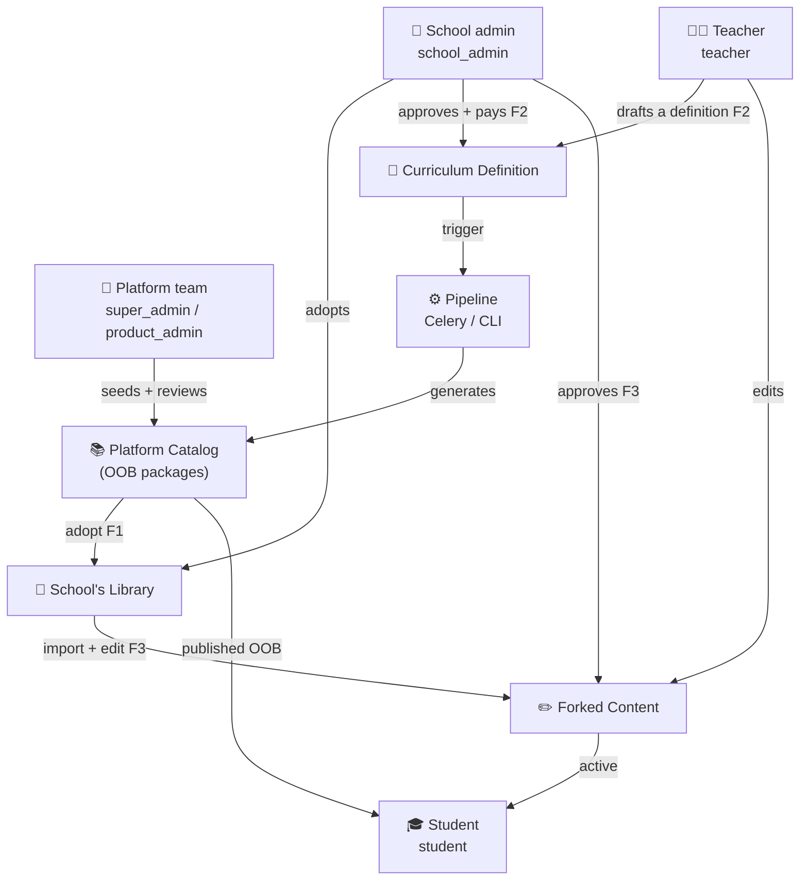

---

## End-to-end journey

The journey breaks into three production lines that hand off to each other. PNG
exports live in [`diagrams/`](diagrams/).

### 1. Platform line (internal)

The internal team generates the out-of-the-box packages and pushes them through
admin review until they are published into the catalog.

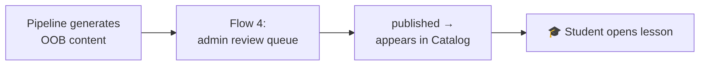

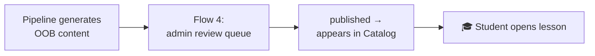

### 2. Path A — Adopt (school_admin + teacher)

A school adopts a published platform package, then optionally forks and
customizes its content. **No publish gate of its own** — it re-uses content the
platform already published.

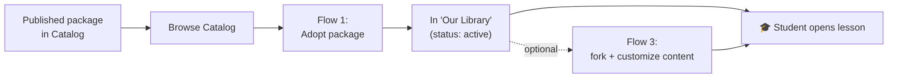

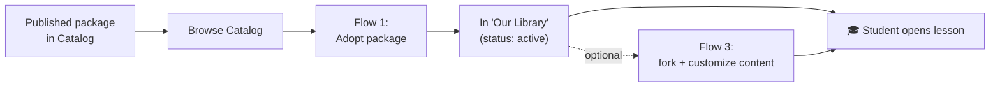

### 3. Path B — Build (teacher → school_admin)

A teacher drafts a definition, the school admin approves and pays, and the
pipeline runs. **Path B's trigger feeds the same pipeline** that produces
platform content — so its output loops back into the platform line's review
queue (Flow 4) before students see it.

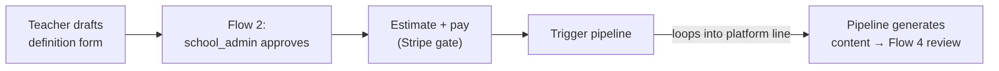

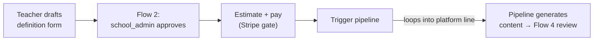

---

## Flow 1 — Platform package adoption (Epic 12 / Phase C)

A school admin adds an existing platform curriculum to their library. Lightweight:
two states, no content generation. The fork (Path A → F3) is created **lazily**
on first import, not at adoption.

**Table:** `school_adopted_curricula` · **Code:** `school/router.py:1462–1700`

| Action | Endpoint | Role |
|---|---|---|
| Browse catalog | `GET /curricula/catalog` | teacher / school_admin |
| List own library | `GET /schools/{id}/library` | teacher / school_admin |
| **Adopt** | `POST /schools/{id}/library` | **school_admin** |
| Deactivate / reactivate | `PATCH /schools/{id}/library/{adoption_id}` | **school_admin** |

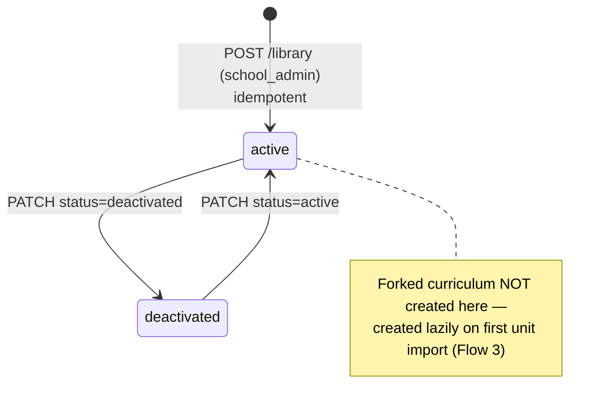

---

## Flow 2 — Curriculum Definition builder (Phase D + E)

A teacher proposes a new custom curriculum; the school admin approves it, then
pays for and triggers the generation pipeline. **Two gates:** approval (admin
judgement) and billing (Stripe).

**Table:** `curriculum_definitions` · **Code:** `school/router.py:1202–1383`

| Action | Endpoint | Role |
|---|---|---|
| Submit definition | `POST /schools/{id}/curriculum/definitions` | teacher / school_admin |
| List / get | `GET …/definitions[/{id}]` | teacher (own) / school_admin (all) |
| **Approve** | `POST …/definitions/{id}/approve` | **school_admin** |
| **Reject** | `POST …/definitions/{id}/reject` (reason required) | **school_admin** |
| Cost estimate | `POST …/definitions/{id}/estimate` | **school_admin** |
| **Trigger pipeline** | `POST …/definitions/{id}/trigger` | **school_admin** |

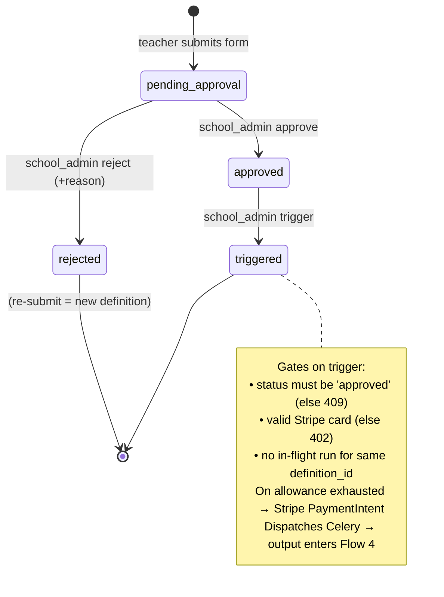

---

## Flow 3 — School content fork + override review (Epic 12 TA-0…TA-4)

A teacher imports an adopted unit's content, edits it, and routes it through a
draft → review → approve cycle. Approval and publish are separate steps; only
the school admin can do them.

**Tables:** `unit_content_overrides`, `unit_content_active_versions` ·
**Code:** `school/router.py:1828–2900`

| Action | Endpoint | Role |
|---|---|---|
| Import OOB unit (creates fork lazily) | `POST /schools/{id}/library/{adoption_id}/units/{unit_id}/import` | teacher / school_admin |
| Save draft edits | `PUT …/content/{cur}/units/{unit}/overrides/{type}` | teacher / school_admin |
| Submit for review | `POST …/content/{cur}/units/{unit}/review` | teacher / school_admin |
| **Approve** (optionally publish) | `POST …/content/{cur}/units/{unit}/approve` | **school_admin** |
| **Reject** | `POST …/content/{cur}/units/{unit}/reject` | **school_admin** |
| Review queue | `GET /schools/{id}/content/review-queue` | **school_admin** |
| Revert to imported snapshot | `POST …/overrides/{type}/revert` | teacher / school_admin* |

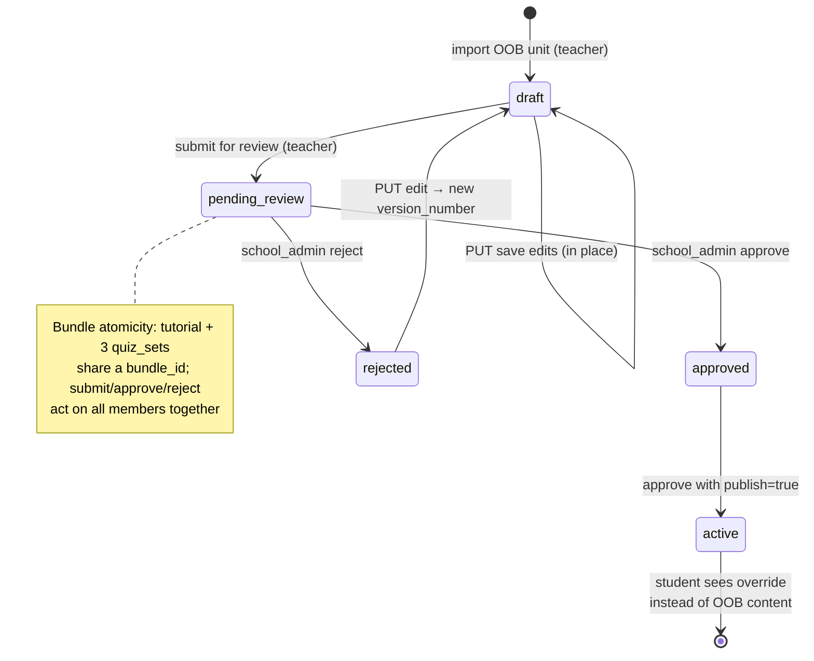

---

## Flow 4 — Admin content review queue (Phase 7)

The platform-side gate. Every pipeline run (whether seeding OOB content or a
school's Path-B build) emits a `content_subject_versions` row that lands here.
Internal team approves, publishes, and can roll back.

**Table:** `content_subject_versions` · **Code:** `admin/router.py:195–700`,
`admin/service.py`

| Action | Endpoint | Permission |
|---|---|---|
| Review queue / detail | `GET /admin/content/review/queue`, `…/{id}` | `review:read` |
| Open review · annotate · rate | `POST …/{id}/open`, `…/annotate`, `…/rate` | `review:annotate` |
| **Approve** (+ batch) | `POST …/{id}/approve`, `…/batch-approve` | `review:approve` |
| **Reject** (optional rerun) | `POST …/{id}/reject` | `review:approve` |
| Block a unit | `POST …/{id}/block` | `content:block` |
| **Publish** | `POST …/versions/{id}/publish` | `content:publish` |
| **Rollback** | `POST …/versions/{id}/rollback` | `content:rollback` |

Permission → role: `developer` = all; `tester` = read + annotate;
`product_admin` / `super_admin` = review:* + content:*.

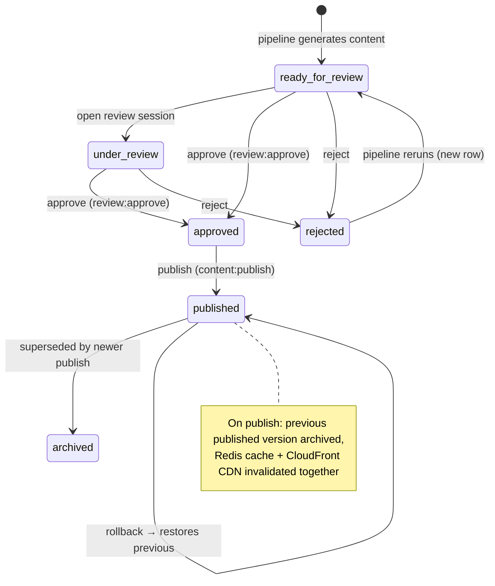

---

## Who approves what — one-glance matrix

| Flow | Initiated by | Approved by | "Live to students" trigger | Billing gate? |
|---|---|---|---|---|
| 1 — Adopt | school_admin | *(no approval)* | Adoption `active` | No |
| 2 — Definition | teacher | **school_admin** | (feeds Flow 4 after pipeline) | **Yes — Stripe** |
| 3 — Fork/override | teacher | **school_admin** | `approve` w/ `publish=true` → `active` | No |
| 4 — Admin review | pipeline | **product_admin / super_admin** | `publish` → `published` | No |

**Two-key rule worth noting:** Path B requires *both* a school_admin approval
(Flow 2) *and* a platform review (Flow 4) before a custom curriculum reaches
students. Path A requires neither — it rides on content the platform already
published.

---

## The two approval gates (read this first)

The word "approve" above means **two different decisions**. Naming them apart is
the clearest way to present — and orchestrate — the lifecycle:

| | **Gate 1 — Commission** | **Gate 2 — Publication** |
|---|---|---|
| Question | *Should this content exist? Worth the spend?* | *Is the generated content good enough for students?* |
| When | **Before** generation | **After** generation, before students see it |
| Acts on | A request — definition / adoption | The actual lesson/quiz/tutorial files |
| Cost | **Yes** — build allowance / Stripe | None — editorial |
| Lives in | Flow 1 (adopt), Flow 2 (definition approve → trigger) | Flow 3 (override approve/publish), Flow 4 (platform) |
| Capability | `curriculum.commission` | `curriculum.review` |

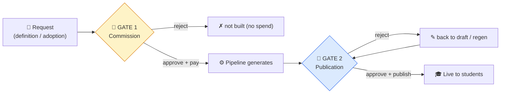

Each gate is a separately-grantable capability (plus a `curriculum_mgmt` umbrella
= both), so a school can split the two between people (maker-checker) or grant
both to one.

**View vs. act:** *seeing* the pending-approval and content-review queues is open
to **anyone holding a curriculum capability** (so a commissioner can watch content
status and a reviewer can watch what's been commissioned); only the matching gate
capability can **act** (approve / trigger / publish). Loading new school curriculum
(definition + trigger) is a commission act. Full design + spec:
[DESIGN_curriculum_mgmt_capability.md](DESIGN_curriculum_mgmt_capability.md) ·
[SPEC_curriculum_mgmt_capability.md](SPEC_curriculum_mgmt_capability.md).
