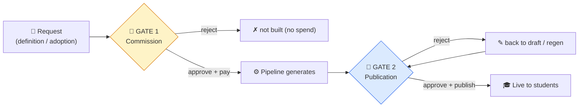
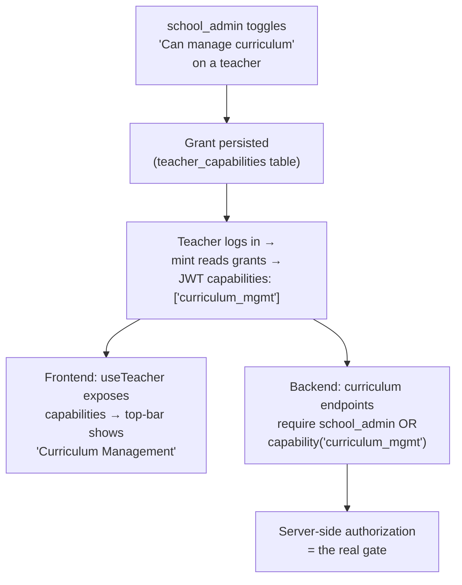

# Design — `curriculum_mgmt` capability

**Status:** Implemented (migration 0059, branch `feat/curriculum-mgmt-capability`, issue #358) · **Date:** 2026-05-21 · **Extends:** [ADR-001](ADR_001_tenancy_and_subscription_model.md) (role model)

> **Superseded UI (#415 / #417, 2026-06):** the standalone top-bar
> **"Curriculum Management"** dropdown described below was replaced by a single
> top-bar **"Administration"** menu (`web/components/layout/AdministrationMenu.tsx`)
> with a **Curriculum** section (this capability, gated `canManageCurriculum`) and a
> **User Management** section (`school_admin` only). The capability/gating model is
> unchanged; only the menu's name/home moved. See
> [`SCHOOL_USER_MANAGEMENT.md`](SCHOOL_USER_MANAGEMENT.md) §8.1. Read "Curriculum
> Management menu" below as "the Curriculum section of the Administration menu".

Lets a school_admin delegate curriculum-management powers to a chosen teacher
**without** promoting them to full school_admin, and groups all curriculum nav
under the **Curriculum** section of the top-bar **Administration** menu, shown
only to those who hold the capability (or are a `school_admin` superset).

## Decisions (locked 2026-05-21)

| Decision | Choice | Why |
|---|---|---|
| Role model | **Additive capability (Model B)** | A teacher keeps `role: "teacher"` and is *also* granted a capability. The current single-`role` JWT is exclusive (`teacher` xor `school_admin`); this adds a parallel `capabilities[]` channel. |
| Does `school_admin` inherit it? | **Yes — implicit superset** | Admins never need an explicit grant. The capability exists to empower *non-admin* teachers. |
| Capability granularity | **Two gates + umbrella** | Curriculum has **two distinct approval gates** (below). They're separate grants — `curriculum.commission`, `curriculum.review` — plus a `curriculum_mgmt` umbrella = both. |
| Maker-checker | **Optional — school decides** | No hard block on one person clearing both gates. A school enforces separation simply by granting the two capabilities to *different* people; a small school grants the umbrella to one. |

> Context for why this isn't "just a role": today `role` is one closed string
> (`useTeacher.ts` even coerces unknown values to `"teacher"`). "Assign X to a
> persona who is still a teacher" is additive, which the single-role model can't
> express — hence a capability alongside `role`, not a replacement for it.

## The two approval gates

"Approve" means two different things in curriculum, made by potentially different
people at different times. Keeping them distinct is the orchestration:

| | **Gate 1 — Commission** | **Gate 2 — Publication** |
|---|---|---|
| Question | *Should this content exist? Worth the spend?* | *Is the generated content good enough for students?* |
| When | **Before** generation | **After** generation, before students see it |
| Acts on | A request — definition / adoption intent | The actual lesson/quiz/tutorial files |
| Cost | **Yes** — build allowance / Stripe | None — editorial |
| Capability | `curriculum.commission` | `curriculum.review` |
| Today's flow | Flow 2 (definition approve → trigger), Flow 1 (adopt) | Flow 3 (override approve/publish); Flow 4 stays platform-admin |

| Capability | Clears | Granted to |
|---|---|---|
| `curriculum.commission` | Gate 1 | budget owner / commissioner |
| `curriculum.review` | Gate 2 | subject-matter reviewer |
| `curriculum_mgmt` (umbrella) | both | one trusted person (no separation needed) |

## The flow (end to end)

## Layer-by-layer change list

| # | Layer | Change | File(s) |
|---|---|---|---|
| 1 | Schema | New `teacher_capabilities(teacher_id, capability, granted_by, granted_at)`, RLS-scoped per school. (Alt: `capabilities text[]` on `teachers`.) | new migration `00NN_teacher_capabilities.py` |
| 2 | Assign API | `PUT /schools/{id}/teachers/{tid}/capabilities` (school_admin only); read on teacher detail | `backend/src/school/router.py` |
| 3 | JWT mint | On login, look up grants → add `capabilities: [...]` to teacher payload | `backend/src/auth/router.py` (`login_local_user` + Auth0/exchange) |
| 4 | Permissions | `ALLOWED_CAPABILITIES = {curriculum.commission, curriculum.review, curriculum_mgmt}`; helper `has_capability(payload, cap)` — true if `school_admin`, the exact cap, or the `curriculum_mgmt` umbrella covering it | `backend/src/core/permissions.py` |
| 5 | Enforcement | Three reusable deps — `require_curriculum_view` (Tier 0), `require_commission` (Gate 1), `require_review` (Gate 2); swap each into its tier's guards (split below) | `backend/src/auth/dependencies.py`, `backend/src/school/router.py` |
| 6 | FE claims | Add `capabilities: string[]`; stop coercion dropping it | `web/lib/hooks/useTeacher.ts` |
| 7 | FE nav | Top-bar "Curriculum Management" dropdown when `canManageCurriculum`; remove curriculum items from rail | `web/components/layout/PortalHeader.tsx`, `web/components/layout/SchoolNav.tsx` |
| 8 | FE assign UI | "☑ Can manage curriculum" on teacher management screen | `web/app/(school)/school/teachers/…` |
| 9 | Tests | Backend guard tests (granted/not/admin-implicit); persona e2e for button visibility + relabels | `backend/tests/`, `web/tests/e2e/` |

### Three-tier guard model (view / commission-act / review-act)

A **read/act split** sits on top of the two gates: *viewing* a queue is broad,
*acting* on it is gated. All endpoints below are in `backend/src/school/router.py`.

**Tier 0 — `require_curriculum_view`** (any curriculum capability `OR` school_admin):
- `GET …/curriculum/definitions` (pending-approval list) · `GET …/definitions/{id}`
- `GET …/content/review-queue`
- `GET …/library`

> Lets a reviewer *see* what's been commissioned (and a commissioner *see*
> content status) without holding the other gate. "View" is not a separate
> capability — it's "holds any curriculum capability".

**Tier 1 — `require_commission`** (`curriculum.commission` | umbrella | school_admin):
- `POST …/library` (adopt) · `PATCH …/library/{adoption_id}`
- `POST …/definitions/{id}/approve` · `…/reject` · `…/estimate` · `…/trigger`
- **Load new school curriculum** (definition create + trigger — the school's
  "load grade JSON/XLSX" equivalent). The admin-console `/admin/pipeline/upload-grade`
  stays **admin-track only** — it seeds *platform* content, out of this capability's scope.

**Tier 2 — `require_review`** (`curriculum.review` | umbrella | school_admin):
- `POST …/content/{cur}/units/{unit}/approve` · `…/reject`

Teacher-open and unchanged (the *propose* side): submit a definition, import a
unit, save a draft, submit-for-review.

**UI ⇒ backend rule:** queue pages render for any viewer, but the Approve/Trigger
buttons are hidden unless the user holds the acting capability — and the backend
returns 403 regardless of the button. Hiding ≠ enforcing.

### Menu items — the **Curriculum** section of the Administration menu

> **Update (#415):** the standalone top-bar "Curriculum Management" dropdown was
> superseded by a single top-bar **"Administration"** menu
> (`web/components/layout/AdministrationMenu.tsx`) that groups two sections:
> **Curriculum** (gated by `canManageCurriculum` — the 5 links below; preserves
> this capability's delegation) and **User Management** (Students/Teachers,
> `school_admin` only). The left-rail "Administration" infra group was renamed
> "Settings". See `docs/SCHOOL_USER_MANAGEMENT.md` §8.1.

The 5 links in the Curriculum section, as shipped in
`web/components/layout/AdministrationMenu.tsx`:

| Label | Route |
|---|---|
| Browse Catalog | `/school/catalog` |
| My Curricula | `/school/library` |
| Lessons & Content | `/school/curriculum/content` |
| Curriculum Builder | `/school/curriculum` |
| Review Queue | `/school/review` |

> Labels were clarified under issue #367 AP-3 (reviewers couldn't distinguish
> "Catalog" / "Our Library" / "Content Library"): Catalog → **Browse Catalog**,
> Our Library → **My Curricula**, Content Library → **Lessons & Content**. See
> `docs/feedback/VISUAL_VALIDATION_GUIDE.md`.

Content-ops items (Visual Library, Content Retention, Backups, Storage) stay under
Admin — they're infrastructure, not authoring.

## Open questions

1. **Revocation latency.** JWT-only check honours a removed grant until token
   expiry. If instant revoke matters, check the grant server-side per request
   (small Redis cache) instead of trusting the claim. *Default: trust the claim;
   accept up-to-token-TTL lag.*
2. **Separation of duties** — *resolved 2026-05-21.* The two gates
   (`curriculum.commission` / `curriculum.review`) make maker-checker possible
   but **optional**: a school enforces it by granting the two capabilities to
   different people. No hard self-approval block; the umbrella `curriculum_mgmt`
   lets one person clear both when separation isn't wanted.
3. **Auth0-track teachers.** Self-registered (non-local) teachers — does the
   grant apply equally? *Default: yes, same `teacher_capabilities` lookup at
   exchange time.*

## Not doing

- Multi-role array replacing single `role` (would touch every `role ==` check —
  out of scope; capability channel avoids it).
- Platform-side (admin console) curriculum review (Flow 4) — this capability is
  school-portal-scoped only.
