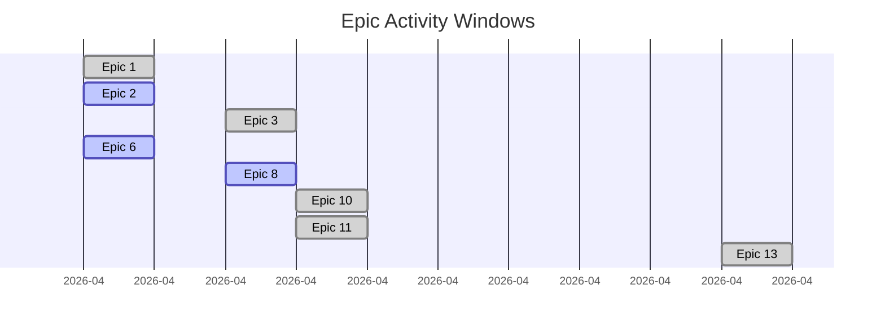

# StudyBuddy OnDemand — Progress Chart

_Auto-generated 2026-04-26T04:49:33+00:00. Regenerated nightly at 21:00 EST._

Source: `docs/epics/` (feature manifest) + `git log` (activity). Script: `scripts/generate_progress.py`.

## Timeline

## Summary

| # | Epic | Status | First | Last | Commits | Tickets | Hot-spots (≥2 commits) |
|---|---|---|---|---|---|---|---|
| 1 | [Multi-Provider LLM Pipeline](epics/EPIC_01_multi_provider_llm.md) | ✅ Complete (F-1 through F-5, 19 tests, migration 0043) | 2026-04-12 | 2026-04-12 | 1 | 2 | — |
| 2 | [Production Launch & Demo Readiness](epics/EPIC_02_production_launch.md) | 💭 Your call | 2026-04-12 | 2026-04-12 | 1 | 2 | — |
| 3 | [Student Mobile App (Expo / React Native)](epics/EPIC_03_student_mobile.md) | ✅ Path B chosen (2026-04-14) — not yet started; parked behind testing phase and  | 2026-04-14 | 2026-04-14 | 2 | 0 | — |
| 4 | [Parent Portal](epics/EPIC_04_parent_portal.md) | 💭 Your call | — | — | 0 | 0 | — |
| 5 | [District Admin](epics/EPIC_05_district_admin.md) | 💭 Your call | — | — | 0 | 0 | — |
| 6 | [Platform Hardening](epics/EPIC_06_platform_hardening.md) | 🚧 In Progress (K-1 through K-3, K-6 complete) | 2026-04-12 | 2026-04-12 | 1 | 3 | — |
| 7 | [Self-Serve Demo System](epics/EPIC_07_self_serve_demo.md) | ✅ Complete | — | — | 0 | 0 | — |
| 8 | [Onboarding Completeness (Address & Measurement Units)](epics/EPIC_08_onboarding_completeness.md) | 💭 Your call | 2026-04-14 | 2026-04-15 | 6 | 8 | H-10×2 |
| 9 | [Accessibility & Personalization](epics/EPIC_09_accessibility_personalization.md) | 💭 Your call | — | — | 0 | 0 | — |
| 10 | [Curriculum Lifecycle & Governance](epics/EPIC_10_curriculum_lifecycle.md) | ✅ Go — all 8 questions + 2 follow-ups resolved 2026-04-15 | 2026-04-15 | 2026-04-15 | 10 | 7 | L-1×4, L-5×2 |
| 11 | [Content Presentation & Formatting](epics/EPIC_11_content_formatting.md) | ✅ Go — 9 questions resolved 2026-04-15 | 2026-04-15 | 2026-04-15 | 8 | 7 | C-9×2 |
| 13 | [Branding Refresh: STEM → Education Enhancement](epics/EPIC_13_branding_refresh.md) | ✅ Complete 2026-04-21 — all five tickets shipped. Minimum-scope PR #246 landed T | 2026-04-21 | 2026-04-21 | 1 | 0 | — |

## Redesign leaderboard

Tickets with 2+ commits — each extra commit is an iteration or rework.

| Ticket | Epic | Commits | First | Last | Span (days) |
|---|---|---|---|---|---|
| L-1 | Epic 10 | 4 | 2026-04-15 | 2026-04-15 | 0 |
| H-10 | Epic 8 | 2 | 2026-04-14 | 2026-04-15 | 1 |
| L-5 | Epic 10 | 2 | 2026-04-15 | 2026-04-15 | 0 |
| C-9 | Epic 11 | 2 | 2026-04-15 | 2026-04-15 | 0 |

## Per-epic detail

### Epic 1 — Multi-Provider LLM Pipeline

- **Status:** ✅ Complete (F-1 through F-5, 19 tests, migration 0043)
- **Epic file:** [EPIC_01_multi_provider_llm.md](epics/EPIC_01_multi_provider_llm.md)
- **Ticket prefix:** `F`
- **Commits attributed:** 1

| Ticket | Commits | First | Last |
|---|---|---|---|
| F-1 | 1 | 2026-04-12 | 2026-04-12 |
| F-5 | 1 | 2026-04-12 | 2026-04-12 |

### Epic 2 — Production Launch & Demo Readiness

- **Status:** 💭 Your call
- **Epic file:** [EPIC_02_production_launch.md](epics/EPIC_02_production_launch.md)
- **Ticket prefix:** `G`
- **Commits attributed:** 1

| Ticket | Commits | First | Last |
|---|---|---|---|
| G-3 | 1 | 2026-04-12 | 2026-04-12 |
| G-5 | 1 | 2026-04-12 | 2026-04-12 |

### Epic 3 — Student Mobile App (Expo / React Native)

- **Status:** ✅ Path B chosen (2026-04-14) — not yet started; parked behind testing phase and 
- **Epic file:** [EPIC_03_student_mobile.md](epics/EPIC_03_student_mobile.md)
- **Ticket prefix:** `M`
- **Commits attributed:** 2

### Epic 4 — Parent Portal

- **Status:** 💭 Your call
- **Epic file:** [EPIC_04_parent_portal.md](epics/EPIC_04_parent_portal.md)
- **Ticket prefix:** `I`
- **Commits attributed:** 0

### Epic 5 — District Admin

- **Status:** 💭 Your call
- **Epic file:** [EPIC_05_district_admin.md](epics/EPIC_05_district_admin.md)
- **Ticket prefix:** `J`
- **Commits attributed:** 0

### Epic 6 — Platform Hardening

- **Status:** 🚧 In Progress (K-1 through K-3, K-6 complete)
- **Epic file:** [EPIC_06_platform_hardening.md](epics/EPIC_06_platform_hardening.md)
- **Ticket prefix:** `K`
- **Commits attributed:** 1

| Ticket | Commits | First | Last |
|---|---|---|---|
| K-1 | 1 | 2026-04-12 | 2026-04-12 |
| K-3 | 1 | 2026-04-12 | 2026-04-12 |
| K-6 | 1 | 2026-04-12 | 2026-04-12 |

### Epic 7 — Self-Serve Demo System

- **Status:** ✅ Complete
- **Epic file:** [EPIC_07_self_serve_demo.md](epics/EPIC_07_self_serve_demo.md)
- **Ticket prefix:** `L`
- **Commits attributed:** 0

### Epic 8 — Onboarding Completeness (Address & Measurement Units)

- **Status:** 💭 Your call
- **Epic file:** [EPIC_08_onboarding_completeness.md](epics/EPIC_08_onboarding_completeness.md)
- **Ticket prefix:** `H`
- **Commits attributed:** 6

| Ticket | Commits | First | Last |
|---|---|---|---|
| H-8 | 1 | 2026-04-14 | 2026-04-14 |
| H-9 | 1 | 2026-04-14 | 2026-04-14 |
| H-10 | 2 | 2026-04-14 | 2026-04-15 |
| L-1 | 1 | 2026-04-15 | 2026-04-15 |
| L-5 | 1 | 2026-04-15 | 2026-04-15 |
| S-1 | 1 | 2026-04-15 | 2026-04-15 |
| S-2 | 1 | 2026-04-15 | 2026-04-15 |
| S-3 | 1 | 2026-04-15 | 2026-04-15 |

### Epic 9 — Accessibility & Personalization

- **Status:** 💭 Your call
- **Epic file:** [EPIC_09_accessibility_personalization.md](epics/EPIC_09_accessibility_personalization.md)
- **Ticket prefix:** `I`
- **Commits attributed:** 0

### Epic 10 — Curriculum Lifecycle & Governance

- **Status:** ✅ Go — all 8 questions + 2 follow-ups resolved 2026-04-15
- **Epic file:** [EPIC_10_curriculum_lifecycle.md](epics/EPIC_10_curriculum_lifecycle.md)
- **Ticket prefix:** `L`
- **Commits attributed:** 10

| Ticket | Commits | First | Last |
|---|---|---|---|
| H-10 | 1 | 2026-04-15 | 2026-04-15 |
| L-1 | 4 | 2026-04-15 | 2026-04-15 |
| L-2 | 1 | 2026-04-15 | 2026-04-15 |
| L-3 | 1 | 2026-04-15 | 2026-04-15 |
| L-4 | 1 | 2026-04-15 | 2026-04-15 |
| L-5 | 2 | 2026-04-15 | 2026-04-15 |
| L-10 | 1 | 2026-04-15 | 2026-04-15 |

### Epic 11 — Content Presentation & Formatting

- **Status:** ✅ Go — 9 questions resolved 2026-04-15
- **Epic file:** [EPIC_11_content_formatting.md](epics/EPIC_11_content_formatting.md)
- **Ticket prefix:** `C`
- **Commits attributed:** 8

| Ticket | Commits | First | Last |
|---|---|---|---|
| C-1 | 1 | 2026-04-15 | 2026-04-15 |
| C-2 | 1 | 2026-04-15 | 2026-04-15 |
| C-3 | 1 | 2026-04-15 | 2026-04-15 |
| C-4 | 1 | 2026-04-15 | 2026-04-15 |
| C-5 | 1 | 2026-04-15 | 2026-04-15 |
| C-6 | 1 | 2026-04-15 | 2026-04-15 |
| C-9 | 2 | 2026-04-15 | 2026-04-15 |

### Epic 13 — Branding Refresh: STEM → Education Enhancement

- **Status:** ✅ Complete 2026-04-21 — all five tickets shipped. Minimum-scope PR #246 landed T
- **Epic file:** [EPIC_13_branding_refresh.md](epics/EPIC_13_branding_refresh.md)
- **Ticket prefix:** `K`
- **Commits attributed:** 1

